<!DOCTYPE html>
<html lang="ro">
<head>
  <meta charset="UTF-8" />
  <title>Portofoliu - Corondan Flavius</title>
  
</head>
<body>
  

    <header>
      

        

          <h1>Corondan Flavius</h1>
          
Portofoliu Personal

        

        

          
          
          
          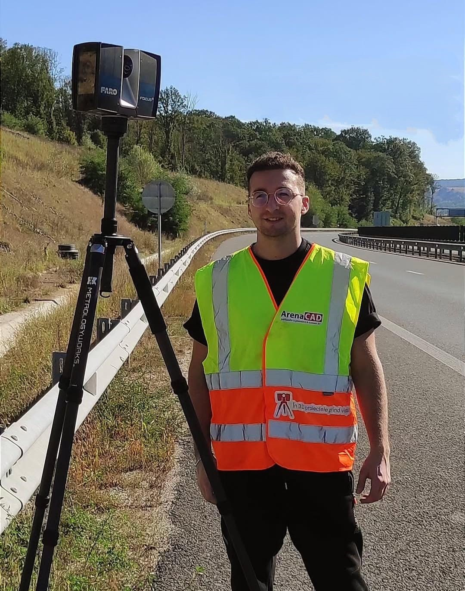
        

     

       

      
      <a href="mailto:flaviuscorondan23@gmail.com" class="contact-text">flaviuscorondan23@gmail.com</a>
      (+40) 742070499
    
  

    </header>
    <section class="section">
      

        <!-- Proiectul 1 -->
        

          

            <h2>Casă Sârbi</h2>
          

          

            ˅
            

              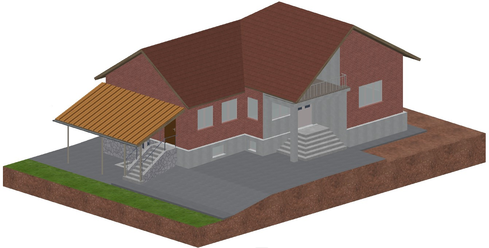
              

                
                

                  
                  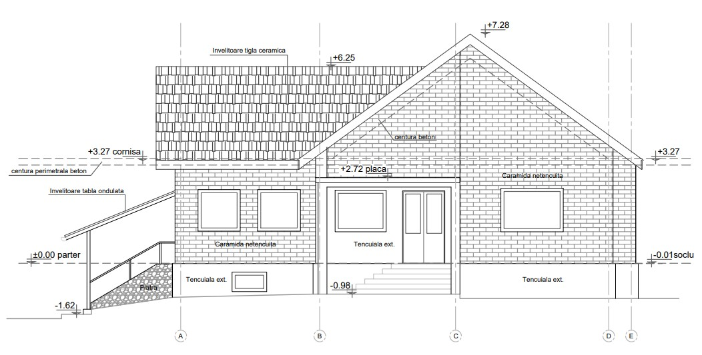
                  
                  
                  
                  
                  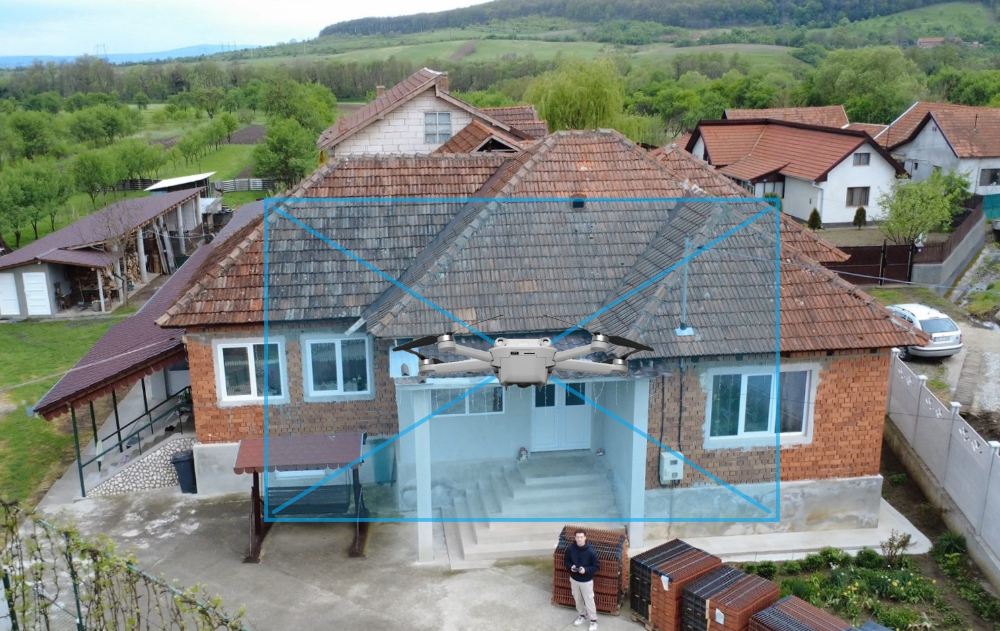
                  
                  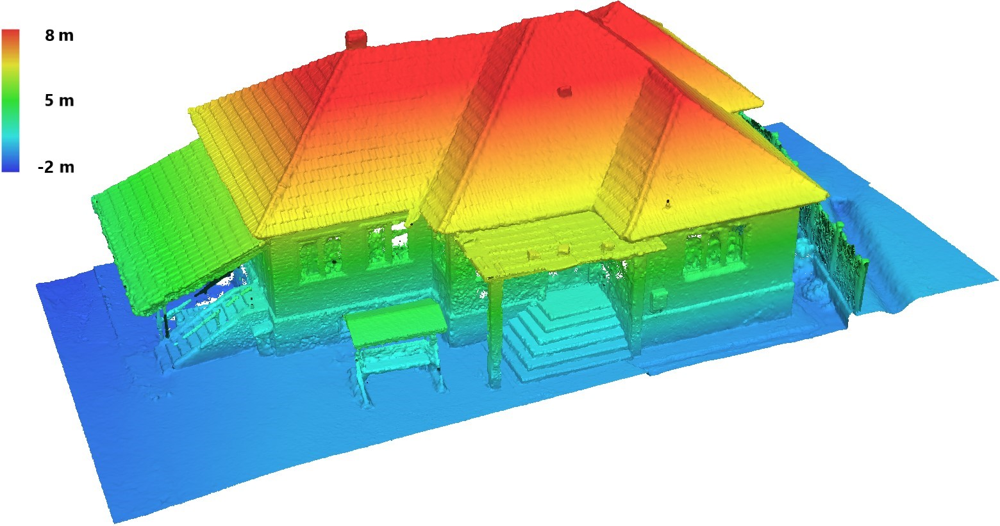
                

                
              

            

            

             
             În acest proiect am realizat modelarea completă a casei din Sârbi, folosindu-mă de un nor de puncte generat prin fotogrammetrie cu ajutorul unei drone. Pe baza acestuai am creat releveul 2D în AutoCAD, care include planurile, fațadele și secțiunile clădirii. Ulterior, am elaborat un model 3D al clădirii în Archicad.
        
            

          

        

        <!-- Proiectul 2 -->
        

          

            <h2>Zona Industrială Calea Buziașului</h2>
          

          

            ˅
            

            
          

                
                

              
              
              
              
              
              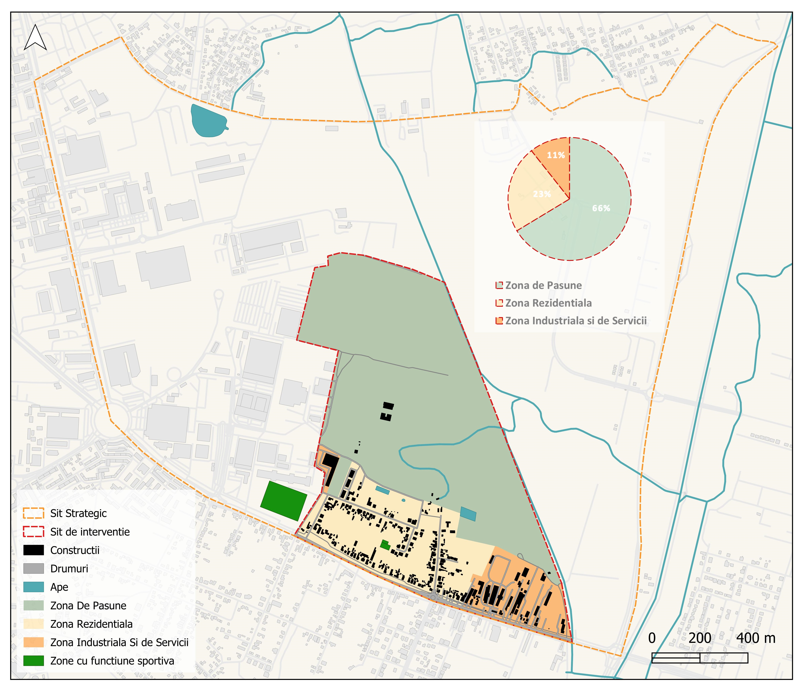
              
              
              
              
              
              
              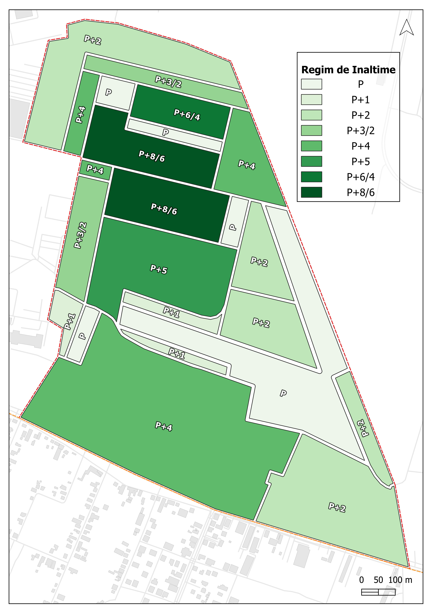
                

                
              

            

            

             
             Se urmărește crearea și reamenajarea unui sit urban printr-o abordare rezilientă, care să răspundă atât nevoilor contemporane, cât și să valorifice caracterul existent al locului. Situl a fost împărțit în două mari părți: cea dintâi, Zona 1- situata în partea central- nordică, dinamică, cu caracter urban intens, destinată activităților de tip birouri, locuințe colective, servicii; Cea de-a doua mare zonă,situată în partea sud-estică a zonei centrale, sunt reinterpretări ale elementelor naturale și antropice.
            

          

        
  

        <!-- Proiectul 3 -->
        

          

            <h2>Autostrada A1 între Deva și Margina</h2>
          

          

            ˅
            

            
          

                
                

              
              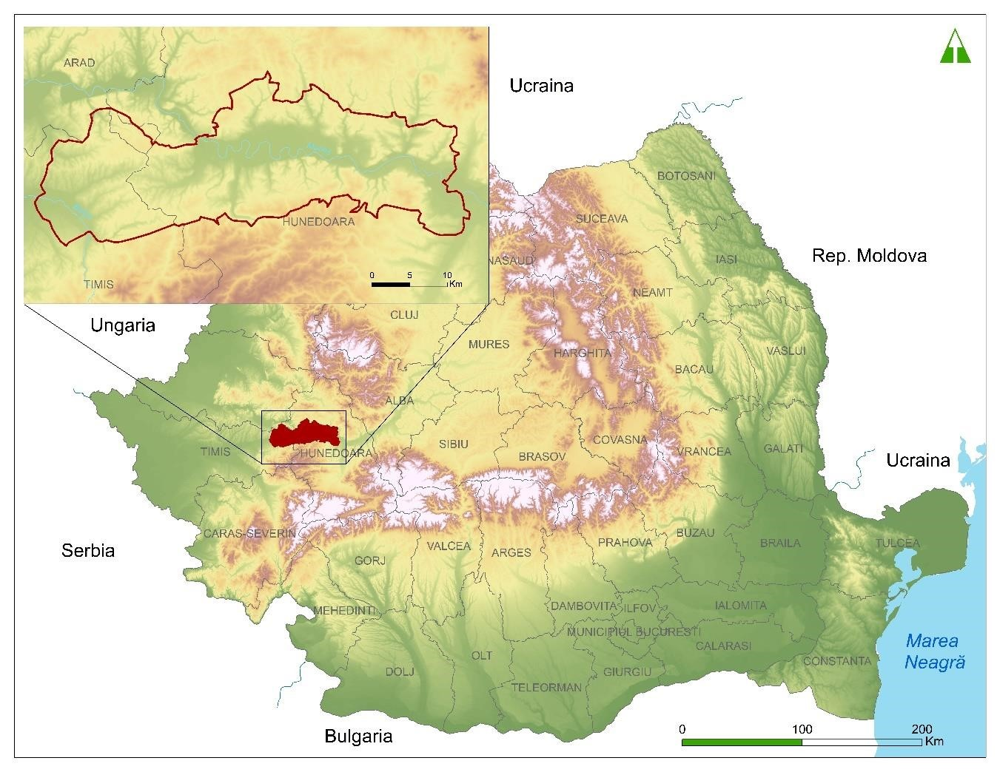
              
              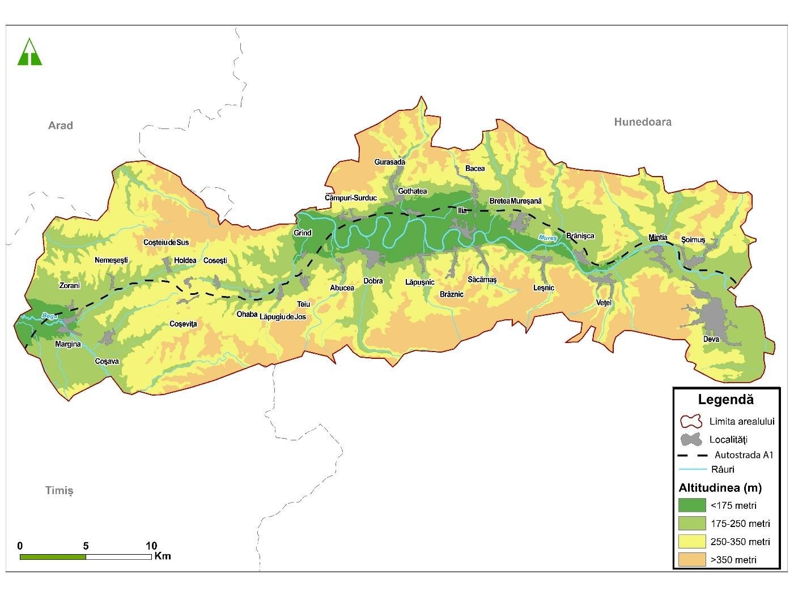
              
              
              
              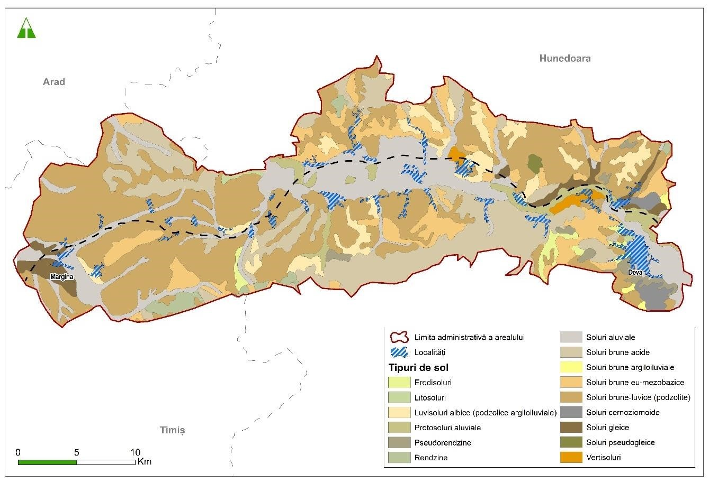
              
              
              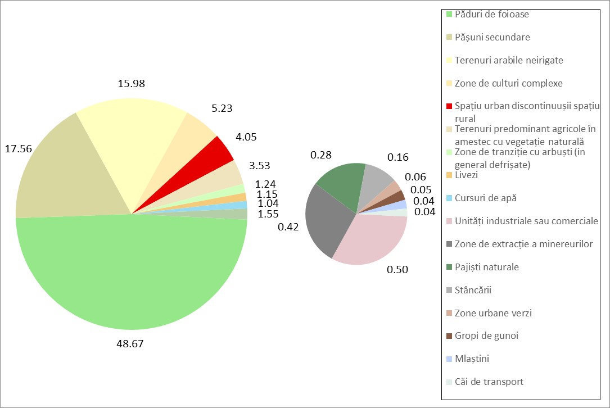
              
              
              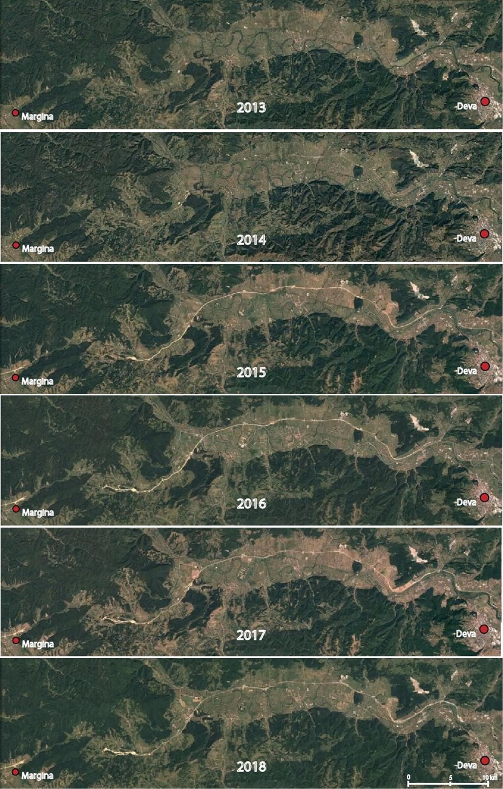
              
             
                

                
              

            

            

             
             Sectorul de Autostradă cuprins între Deva și Margina joacă un rol esențial ca patre integrată din structura cuprinzătoare a întregii rețele a Autostrăzi A1. În ansamblu, consecința definitorie a impactului geografic al arealului de studiu este una pozitivă privită din perspectiva subiectelor principale analizate, mai precis în privința componentei mediului, dar și componentei socio-economice.
        
            

          

        
  

    
        <!-- Proiectul 4 -->

  

    <h2>Alte Reprezentări</h2>
  

  <!-- 🔽 Aici adăugăm clasa suplimentară -->
  

    ˅

    

      

        
        

              
             
             
             
             
             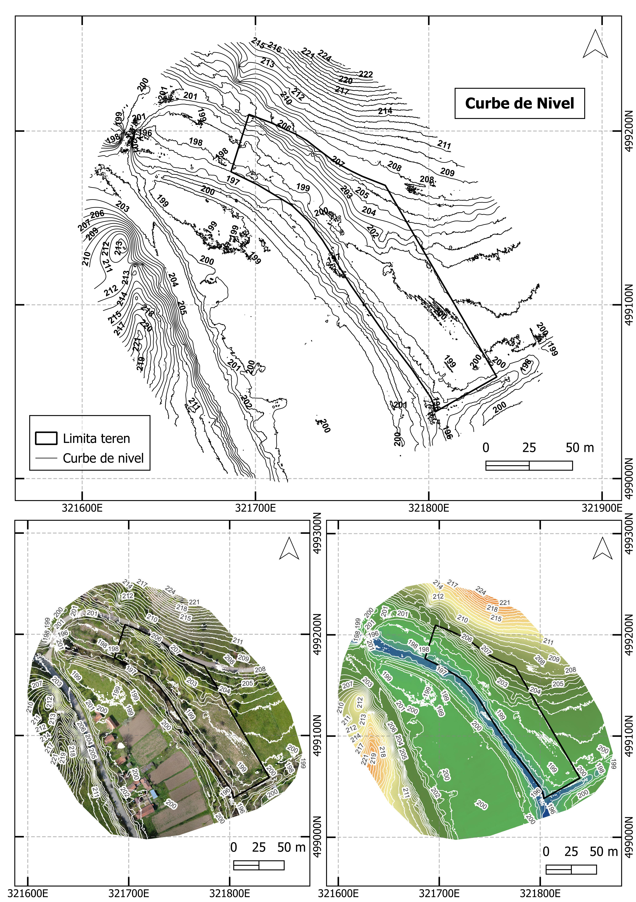
             
             
             
             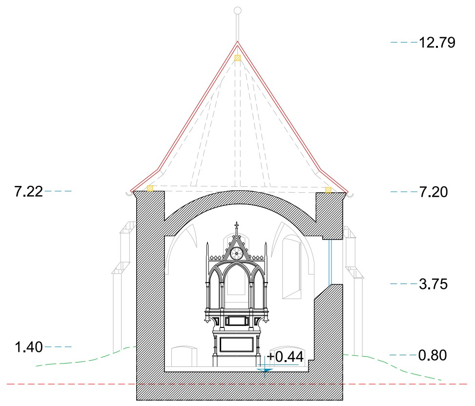
             
             
             
              
             
                

                
              

            

            

             
              Planse aleatorii realizate de-a lungul timpului in diferite programe si moduri. S-au colectat date din teren, a urmat procesarea datelor brute, apoi prelucrarea acestora. Am folosit programul Autocad pentru realizarea planselor de arhitectua, si proiectare a drumurilor. Iar pentru maparea arealelor am folosit softwareul QGIS 
            

          

        
  
  
  

    
  

  
  
</body>
</html>
